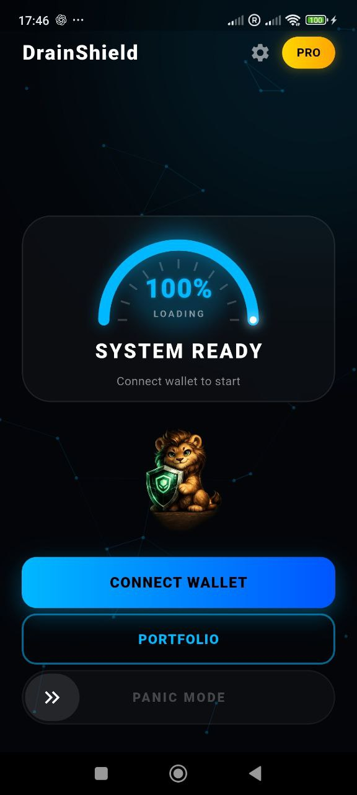
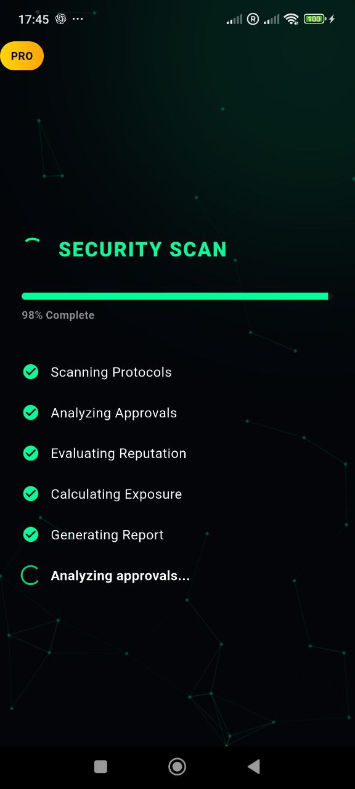
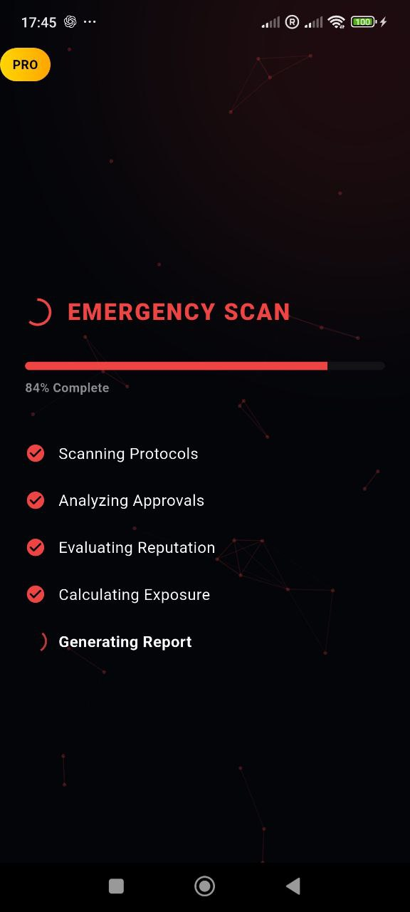

# 🛡️ DrainShield

<p align="center">
  
</p>

<p align="center"><b>Proactive Web3 wallet security</b></p>

**DrainShield** is a Web3 wallet security tool designed to protect users from malicious token approvals and permission abuse.  
It scans wallets for risky ERC-20 approvals, analyzes their security level, and allows users to instantly revoke dangerous permissions.

DrainShield focuses on **proactive protection** rather than reacting after a wallet has already been compromised.

---

## 🚀 Overview

Modern DeFi applications require users to grant token approvals to smart contracts.  
These approvals often remain active indefinitely and can be exploited if the contract becomes malicious or compromised.

DrainShield helps users:

- Detect risky approvals
- Monitor wallet permissions
- Revoke dangerous allowances
- Protect assets with an emergency **Panic Mode**

The application does **not store private keys** and works directly with the user’s wallet via secure Web3 connections.

---

## ✨ MVP v0.1 Features

### 🔐 Wallet Security Scanner
Scan wallets for active ERC-20 approvals and detect risky permissions.

### 🧠 Risk Engine
Automatically classifies approvals based on:
- unlimited allowances
- contract verification status
- known protocols
- suspicious spender patterns

### 🚨 Panic Mode
One-tap emergency feature to revoke all high-risk approvals instantly.

### 👛 Multi-Wallet Support
Manage and monitor multiple EVM-compatible wallets in one place.

### 📊 Portfolio Overview
Quick overview of assets and their associated security exposure.

### ⚡ Fast Blockchain Data
Powered by **Moralis APIs** for fast and reliable blockchain indexing.

---

## ⛓ Supported Networks

### Current
- **BNB Smart Chain (BSC)**

### Planned
- Ethereum
- Polygon
- Arbitrum
- Base

---

## 📸 Screenshots

| Dashboard | Security Scan | Panic Mode |
| :---: | :---: | :---: |
|  |  |  |

---

## 🏗 Architecture

DrainShield is built using a modular architecture designed for security and scalability.

### Application Layers

**Flutter UI Layer**
- Cross-platform mobile interface
- Wallet connection and interaction

**Wallet Integration**
- WalletConnect v2 support
- Secure external wallet signing

**Risk Engine**
- Approval analysis
- Risk classification
- Panic Mode filtering

**Blockchain Data Layer**
- Moralis API integration
- Token approval indexing
- Contract verification checks

**Transaction Builder**
- Constructs revoke transactions
- Executes revocations through connected wallet

---

## 🔐 Security Model

DrainShield follows several strict security principles:

- The application **never stores private keys**
- All transactions are **signed inside the user’s wallet**
- No custody of user funds
- Local risk analysis before transaction execution
- Panic Mode prioritizes only **high-risk approvals**

---

## 🛠 Technology Stack

- **Flutter**
- **Dart**
- **WalletConnect v2**
- **Moralis API**
- **EVM blockchain infrastructure**

---

## ⚙️ Getting Started

### Requirements

- Flutter SDK (3.13 or newer)
- Android Studio or VS Code
- Moralis API Key

Flutter installation guide:  
https://docs.flutter.dev/get-started/install

### Installation

Clone the repository:

```bash
git clone https://github.com/VOVAN1980/drainshield.git
cd drainshield
flutter pub get
Moralis Configuration

Create the file:

secrets/moralis.json

Example:

{
  "MORALIS_API_KEY": "YOUR_API_KEY"
}
Run the Application
flutter run
🗺 Roadmap
v0.1 (Current MVP)

Wallet connection

Approval scanner

Risk engine

Panic Mode

Basic portfolio overview

v0.2

Spender intelligence database

Contract reputation analysis

Transaction simulation

Advanced risk scoring

v0.3

Background monitoring

Push notifications

Automatic risk alerts

Future

Cross-chain monitoring

DeFi protocol risk intelligence

AI-based approval detection

🔒 Privacy Policy

## Privacy Policy

(https://vovan1980.github.io/drainshield/privacy.html)

🤝 Contributing

Contributions are welcome.

To contribute:

Fork the repository

Create a new branch

Commit your changes

Open a Pull Request

📄 License

This project is licensed under the MIT License.
See the LICENSE
 file for details.

⚠ Disclaimer

DrainShield provides security analysis and recommendations but does not guarantee protection against all risks in decentralized finance.
Users remain responsible for verifying transactions before signing them.

🌐 Project Status

DrainShield is currently in active development (MVP stage).

Feedback, testing, and community contributions are highly appreciated.
